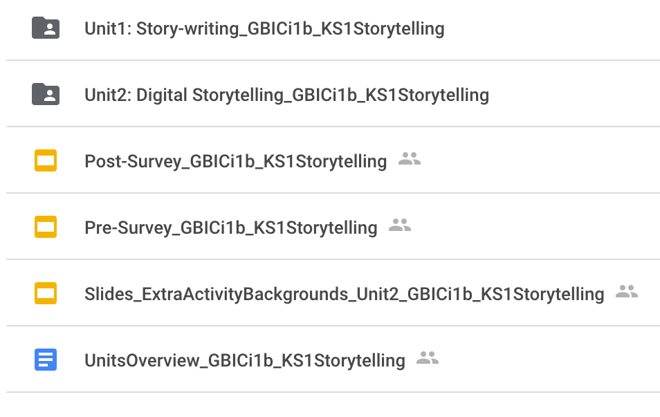
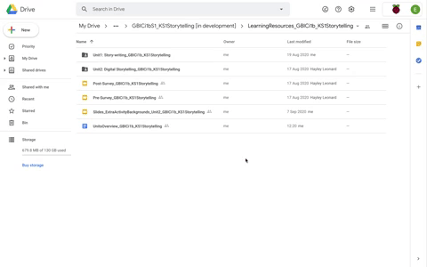

## The resources

The teaching resource folder includes:
+ Units Overview (GoogleDoc)
+ Unit 1, Story-writing (folder)
+ Unit 2, Storytelling (folder)
+ Pre-survey (Presentation slide)
+ Post-survey (Presentation slide)
+ Extra Activity Backgrounds (Presentation slide)

{:width="400px"}

You will be using ScratchJr to teach key programming concepts to produce interactive animations. The resources for the 12-week trial are written for both the ScratchJr app and an emulator. Learners need not be familiar with programming at the start of the trial. Educators should be familiar with the ScratchJr Interface, Blocks, and Coding Area, as well as Characters. Detailed instructions for completing each task are provided in the lesson plans so that educators who are less familiar with ScratchJr are able to practice in advance when preparing for the lessons. Session 2 focuses on building up your expertise in SrcatchJr and your familiarity with the resources.

You can see in the Units Overview that the first topic consists of six weeks of a unit for Story-writing. Each week gradually introduces learners to the ScratchJr environment and the blocks that can be used to construct stories.

The second topic outlined in the Units Overview consists of six weeks of a unit for Digital Storytelling. The lessons form a journey that starts with exploring interactive animation tools. Over the course of the unit, learners will explore the programming concepts of sequencing, selection and repetition through the control of characters to produce a storyboard for a digital story.

You will find the lesson plans, slides and associated resources in separate folders for Unit 1 Story-writing and Unit 2: Digital Storytelling
Within each of the unit folders, you will have subfolders for all of the individual lessons and their associated resources.

Together, these will be all the resources you need to participate in the Teaching Approach trial.

Click the green button (below right) for the next step in this session.

If you need to go back to the list of contents for this session (Session 2), click [here](https://projects.raspberrypi.org/en/projects/KS1StorytellingTraining_Session2_GBICi1b). 
If you need to access the menu for Sessions 1, 2 and 3, click [here](https://projects.raspberrypi.org/en/pathways/ks1-storytellingtraining-gbici1b).
