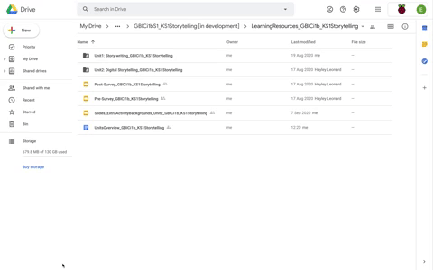

## Overview

The first document you need to read is the Units Overview which provides essential information relating to the teaching approach Storytelling trial, including details on preparing for the Units.

You can see that each lesson is set out with a brief description and the learning objectives and success criteria for that lesson. The overview also includes links to the relevant lesson plans and resources. 

You will note that some of the information in the Unit Overview, such as data collection, has been covered elsewhere in the training sessions. This document offers a useful place to go as a signpost and reminder of key considerations. The document includes:
+ Introduction
+ Resources
+ Subject knowledge
+ ScratchJr app
+ Devices and live demonstration
+ Survey

Click the green button (below right) for the next step in this session.

If you need to go back to the list of contents for this session (Session 2), click [here](https://projects.raspberrypi.org/en/projects/KS1StorytellingTraining_Session2_GBICi1b). 
If you need to access the menu for Sessions 1, 2 and 3, click [here](https://projects.raspberrypi.org/en/pathways/ks1-storytellingtraining-gbici1b).
