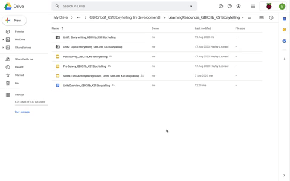
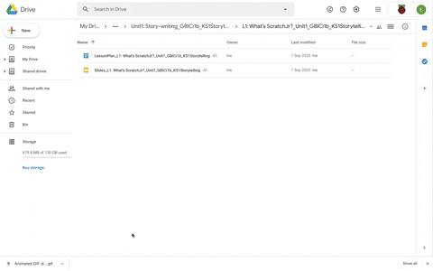

## Lesson Plans and Presentation Slides
Now, having read the overview and undertaken Lesson 1, Unit 1 ,you will now explore the 11 lessons in turn. Each lesson includes a Lesson Plan and Presentation Slides.

You are now going to have the opportunity to explore the learning resources independently. You should take time now within the course to:
+ Get to grips with the units as a whole
+ Consider how you can best implement the Storytelling approach in your own classroom with your own learners.

This is a good opportunity to familiarise yourself with the ScratchJr tasks provided. We suggest that you take around an hour now to access and explore the resources, and then return to this course for the final pieces of information about data collection and ongoing support.

**Lesson Plans**
All the Lesson Plans are structured in a consistent way with the following sub-headings:
+ Lesson overview
+ Learning objectives
+ Success Criteria
+ Key vocabulary
+ Assessment opportunities
+ Preparation: subject knowledge and what you will need for the lesson.

The table in the Outline plan breaks down delivery of the lesson in to timed activities which correlate with slides from the Presentation Slides. (Note that the Presentation Slides labels the activities in the top right-hand corner to help you navigate the lesson).

Work your way through each lesson exploring the Lesson Plan and its relationship to the Presentation Slides. Allowing yourself time for preparation now will give you the best chance to incorporate the Storytelling teaching approach into your lessons when the trial begins. 

**Presentation Slides**
All the Presentation Slides are structured in a consistent way beginning with a Lesson Objective and Success Criteria. This introduction is followed by the lesson activities. The last three slides of every lesson’s Presentation Slides always include the following slides: a Plenary; an assessment of the pupils’ confidence; and details on the Next lesson.

Investigate the resources.

Make a note of anything which you need to clarify. You can use the feedback form to ask questions to the trial community. Or get in touch with us via email if you have any queries at any time before, during or after the trial via [genderresearch@raspberrypi.org](mailto:genderresearch@raspberrypi.org).

Part two of this session explores two lessons in detail giving you the opportunity to develop a working understanding of the relationship between the Lesson Plans and the Presentation Slides as well as to experience the lessons from the pupils' perspective. You will begin to code in ScratchJr and develop an interactive animation.

Click [here](https://projects.raspberrypi.org/en/projects/KS1StorytellingTraining_Session3_GBICi1b) to access the next session, Session 3.

If you need to go back to the list of contents for this session (Session 2), click [here](https://projects.raspberrypi.org/en/projects/KS1StorytellingTraining_Session2_GBICi1b). 
If you need to access the menu for Sessions 1, 2 and 3, click [here](https://projects.raspberrypi.org/en/pathways/ks1-storytellingtraining-gbici1b).

**Please DO NOT click the green 'What's next' button (below-right) as this link is NOT relevant to this training course.**
